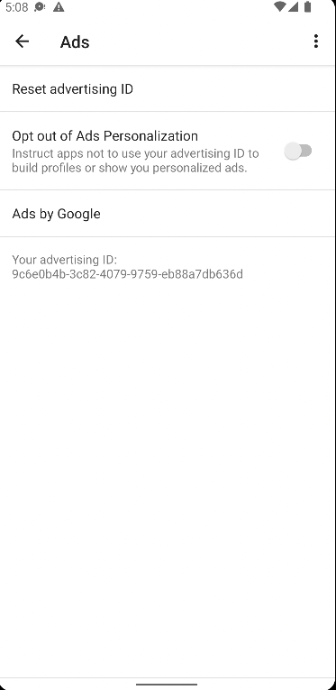
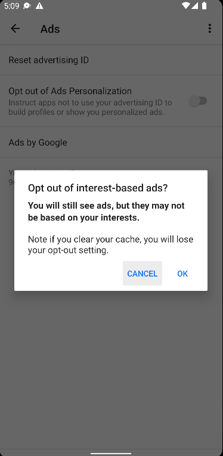
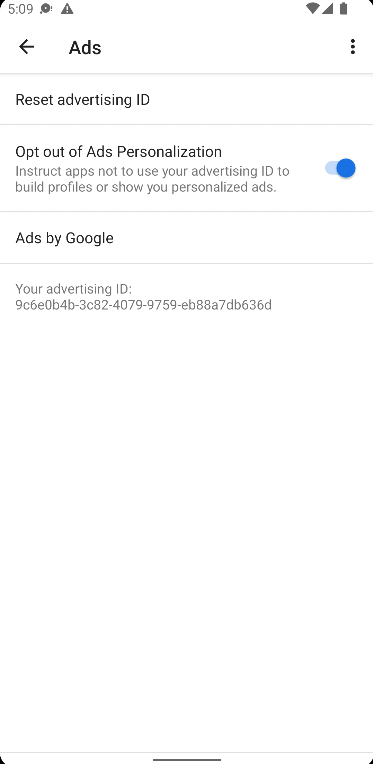
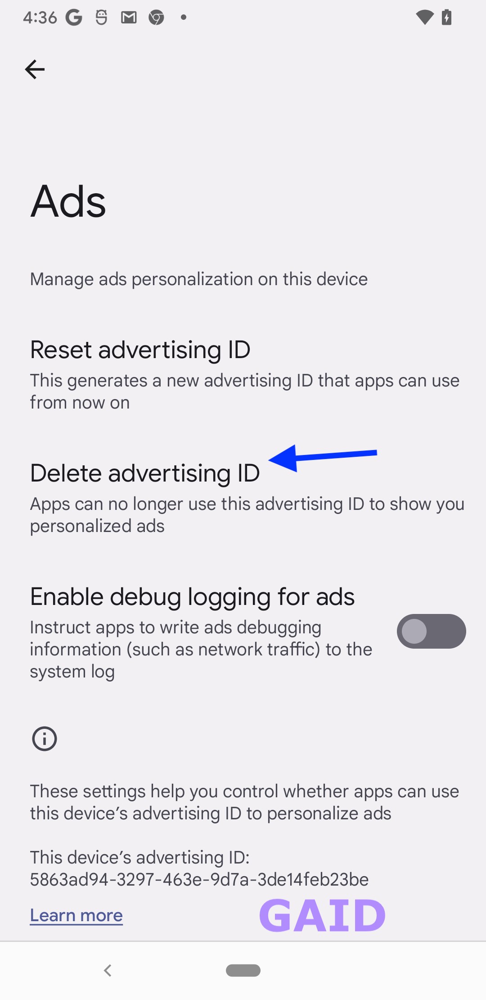
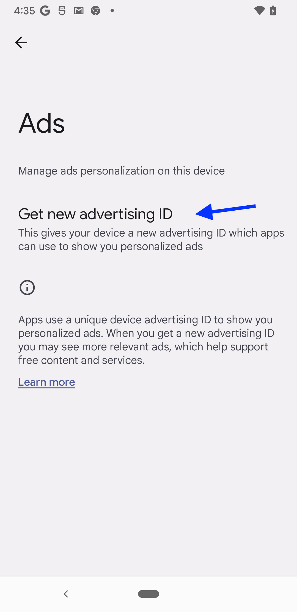

# Getting Started

# Android Test App
## GAID Background
In Android, users are opted-in to ad ID tracking by default. They can choose to opt out of tracking in Android Settings at the device level.
Developers using ad ID should get ad ID from the API each time it is used, as permissions for ad tracking and/or the value of the ID itself may be changed at any time.
- In older versions of Android, the ad ID opt-in/out is a toggle, where the existing ad ID value remains unchanged.

[](./assets/old_adid_setting_optin.png)
[](./assets/old_adid_setting_optout_prompt.png)
[](./assets/old_adid_setting_optout.png)

- In newer versions of Android, the ad ID opt-in/out is a delete, where the existing ad ID value is deleted and replaced by an all-zero ad ID until the ad ID is recreated by user selection.

[](./assets/new_adid_setting_optin.png)
[](./assets/new_adid_setting_optout.png)


- note: users can see their ad ID value in the settings page for Ads.
- note: unlike iOS, the permission is more passive, where the user has to seek out the option to turn
off tracking, and no permissions prompt is shown on first launch, etc.

Based on Android emulator testing:
- changes in opt-in/out status or ad ID value does not terminate the app; in iOS changing opt-in/out status terminates the affected app
    - thus, the guidance for only accessing the ad ID through the API and not caching the value
    - practically, it may be cumbersome to detect changes at arbitrary points in the logic throughout the app;
    it may be helpful to use:
        - a getter helper for ad ID that detects and handles changes in value or opt-in/out
        - using app lifecycle foreground event to check for changes in ad ID value or opt-in/out
- opt-out does not seem to cause the admob SDK to return an all-zeros ad ID (based on testing with emulator)
    - however, opt-in/out status can be determined through the property `AdvertisingIdClient.Info.isLimitAdTrackingEnabled`

See Google's [Advertising ID help article](https://support.google.com/googleplay/android-developer/answer/6048248?hl=en) for the latest requirements to access ad ID through AdvertisingIdClient APIs.

As of this writing (Wed, April 13 2022), all devices that support Google Play Services follow the device level opt-in/out status, regardless of the app’s target SDK level. This is enforced starting from April 1, 2022. Prior to this, it was only applied to devices running Android 12.

Required manifest permissions to use ad ID (normal level permission):
This is only required for Android 13+ (Apps with target API level set to 33 (Android 13))
Conversely, for apps with target API level set to 32 (Android 12L) or older, this permission is not needed.
If it is not declared when required, you will get an all-zero ad ID.
In the test app's case, the current targetSdkVersion is 30, so the permission is not required.
note: some SDKs may already include this permission in their manifest, so you do not need to include it separately; ex: Google Mobile Ads SDK (play-services-ads).

The permission is:
```xml
<uses-permission android:name="com.google.android.gms.permission.AD_ID"/>
```
To prevent [permission merging](https://developer.android.com/studio/build/manage-manifests#merge-manifests) in manifest files
```xml
<uses-permission android:name="com.google.android.gms.permission.AD_ID" tools:node="remove"/>
```


## Google Mobile Ads Lite SDK
A lightweight version of the Google Mobile Ads SDK: https://developers.google.com/admob/android/lite-sdk  
API reference: https://developers.google.com/android/reference/com/google/android/gms/ads/identifier/AdvertisingIdClient

Google AdMob requires an application ID specified in the AndroidManifest.xml when the SDK is included in the build, otherwise the app will crash. However, to just test the ad ID fetching process, the SDK doesn't have to be initialized. See Google's quick start guide for a detailed implementation guide (free sample app ID provided by Google for testing purposes in step 3): https://developers.google.com/admob/android/quick-start#import_the_mobile_ads_sdk

## AndroidX Ads SDK
Overview: https://developer.android.com/jetpack/androidx/releases/ads#1.0.0-alpha04  
API reference: https://developer.android.com/reference/androidx/ads/identifier/AdvertisingIdClient  
Please be advised that based on testing with SDK version 1.0.0-alpha04 on emulator Pixel_3a_API_32_arm64-v8a, the SDK's [`AdvertisingIdClient.isAdvertisingIdProviderAvailable(Context)`](https://developer.android.com/reference/androidx/ads/identifier/AdvertisingIdClient#isAdvertisingIdProviderAvailable(android.content.Context)) does not return `true`, even when a valid app `Context` is provided. See additional source: https://stackoverflow.com/questions/59217195/how-do-i-use-or-implement-an-android-advertising-id-provider  
Following the guide for ad-id may therefore not work: https://developer.android.com/training/articles/ad-id  
Note: as of this writing, the last time the AndroidX Ads SDK was updated was January 22, 2020 - Version 1.0.0-alpha04

## Example AndroidX Ads Implementation
Note that AndroidX Ads SDK doesn't seem to work; `AdvertisingIdClient.isAdvertisingIdProviderAvailable(Context)` does not return `true` even with valid app `Context`
```kotlin
if (AdvertisingIdClient.isAdvertisingIdProviderAvailable(context.applicationContext)) {
    val advertisingIdInfoListenableFuture = AdvertisingIdClient.getAdvertisingIdInfo(context.applicationContext)
    addCallback(advertisingIdInfoListenableFuture,
            object : FutureCallback<AdvertisingIdInfo> {
                override fun onSuccess(adInfo: AdvertisingIdInfo?) {
                    if (adInfo == null) {
                        return
                    }
                    val id = adInfo.id
                    val providerPackageName = adInfo.providerPackageName
                    val isLimitTrackingEnabled = adInfo.isLimitAdTrackingEnabled
                    Log.d("Custom_Identity_Fragment", "id: $id, providerPackageName: $providerPackageName, isLimitTrackingEnabled: $isLimitTrackingEnabled")
                }

                override fun onFailure(t: Throwable) {
                    Log.e("Custom_Identity_Fragment", "Failed to connect to Advertising ID provider: $t")
                    // Try to connect to the Advertising ID provider again, or fall
                    // back to an ads solution that doesn't require using the
                    // Advertising ID library.
                }
            },
            Executors.newSingleThreadExecutor()
    )
} else {
    Log.d("Custom_Identity_Fragment", "The Advertising ID client library is unavailable.")
    // The Advertising ID client library is unavailable. Use a different
    // library to perform any required ads use cases.
}
```