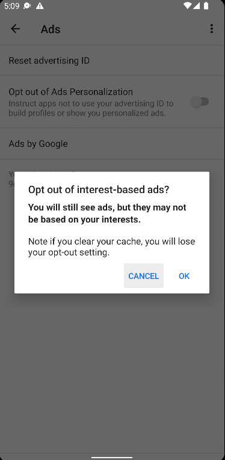
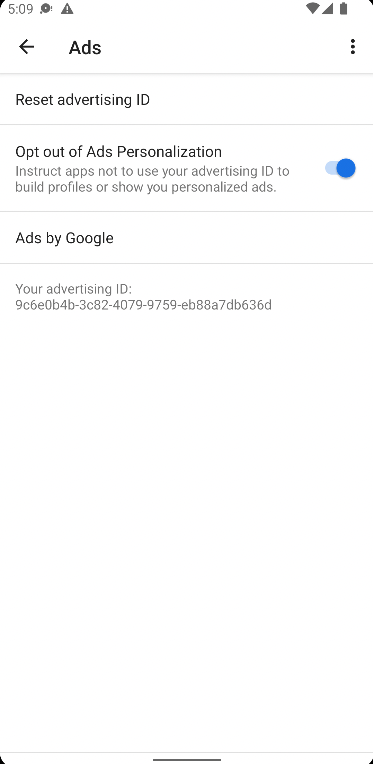

# Getting started with the test app
## Testing tips with Android advertising identifier
In Android, users are opted-in to ad ID tracking by default. They can choose to opt out of tracking in Android Settings at the device level.
Developers using ad ID should get ad ID from the API each time it is used, as permissions for ad tracking and/or the value of the ID itself may be changed at any time.
- In some Android environments, the ad ID opt-in/out is a toggle where the existing ad ID value remains unchanged.

[](./assets/old_adid_setting_optin.png)
[](./assets/old_adid_setting_optout_prompt.png)
[](./assets/old_adid_setting_optout.png)

- In other Android environments, the ad ID opt-in/out is a delete, where the existing ad ID value is deleted and replaced by an all-zero ad ID until the ad ID is recreated by user selection.

[](./assets/new_adid_setting_optin.png)
[](./assets/new_adid_setting_optout.png)


- Note: There is no permission prompt shown to the user on first launch; the user can control the ad tracking preferences and see their ad ID value in the device settings in the Ads view.

Based on Android emulator testing:
- changes in opt-in/out status or ad ID value does not terminate the app; in iOS changing opt-in/out status terminates the affected app
    - thus, the guidance for only accessing the ad ID through the API and not caching the value
    - practically, it may be cumbersome to detect changes at arbitrary points in the logic throughout the app;
    it may be helpful to use:
        - a getter helper for ad ID that detects and handles changes in value or opt-in/out
        - using app lifecycle foreground event to check for changes in ad ID value or opt-in/out
- opt-out does not seem to cause the AdMob SDK to return an all-zeros ad ID (based on testing with emulator)
    - however, opt-in/out status can be determined through the property `AdvertisingIdClient.Info.isLimitAdTrackingEnabled`

See Google's [Advertising ID help article](https://support.google.com/googleplay/android-developer/answer/6048248?hl=en) for the latest requirements to access ad ID through AdvertisingIdClient APIs.

Example implementation of using a getter to 
```kotlin
import android.content.Context
import android.util.Log
import com.google.android.gms.ads.identifier.AdvertisingIdClient
import com.google.android.gms.common.GooglePlayServicesNotAvailableException
import com.google.android.gms.common.GooglePlayServicesRepairableException
import java.io.IOException

/**
* Async method that retrieves the ad ID from the `AdvertisingIdClient` (from Google's gms.ads SDK).
* Sanitizes ad ID disabled and exceptions to the empty string (`""`), for easy use with `MobileCore` ad ID APIs.
* Should *only* be called from a background thread/coroutine.
*
* @param applicationContext: The application context that has the advertising ID provider to obtain the ad ID from.
* @return ad ID string; ad ID value from the provider if available and tracking is allowed, empty string otherwise.
*/
suspend fun getGAID(applicationContext: Context): String {
    var adID = ""
    try {
        val idInfo = AdvertisingIdClient.getAdvertisingIdInfo(applicationContext)
        if (idInfo.isLimitAdTrackingEnabled) {
            Log.d(LOG_TAG, "Limit Ad Tracking is enabled by the user, setting ad ID to \"\"")
            return adID
        }
        Log.d(LOG_TAG, "Limit Ad Tracking disabled; ad ID value: ${idInfo.id}")
        adID = idInfo.id
    } catch (e: GooglePlayServicesNotAvailableException) {
        Log.d(LOG_TAG, "GooglePlayServicesNotAvailableException while retrieving the advertising identifier ${e.localizedMessage}")
    } catch (e: GooglePlayServicesRepairableException) {
        Log.d(LOG_TAG, "GooglePlayServicesRepairableException while retrieving the advertising identifier ${e.localizedMessage}")
    } catch (e: IOException) {
        Log.d(LOG_TAG, "IOException while retrieving the advertising identifier ${e.localizedMessage}")
    }
    Log.d(LOG_TAG, "Returning ad ID value: $adID")
    return adID
}
```
Callsite:
```kotlin
 // Create IO (background) coroutine scope to fetch ad ID value
val scope = CoroutineScope(Dispatchers.IO).launch {
    val adID = sharedViewModel.getGAID(context.applicationContext)
    Log.d(LOG_TAG, "Sending ad ID value: $adID to MobileCore.setAdvertisingIdentifier")
    MobileCore.setAdvertisingIdentifier(adID)
}
```

Required normal permissions to use ad ID (Android 13 and above):
```xml
<uses-permission android:name="com.google.android.gms.permission.AD_ID"/>
```
For more specifics on the use of this permission in the context of Android version requirements and permission merging through SDKs, see the [AdvertisingIdClient.Info documentation](https://developers.google.com/android/reference/com/google/android/gms/ads/identifier/AdvertisingIdClient.Info).


## Google Mobile Ads Lite SDK
A lightweight version of the Google Mobile Ads SDK: https://developers.google.com/admob/android/lite-sdk  
`AdvertisingIdClient` API reference: https://developers.google.com/android/reference/com/google/android/gms/ads/identifier/AdvertisingIdClient

Google AdMob requires an application ID specified in the AndroidManifest.xml when the SDK is included in the build, otherwise the app will crash. However, to just test the ad ID fetching process, the SDK doesn't have to be initialized. See Google's quick start guide for a detailed implementation guide (free sample app ID provided by Google for testing purposes in step 3): https://developers.google.com/admob/android/quick-start#import_the_mobile_ads_sdk

## AndroidX Ads SDK
Overview: https://developer.android.com/jetpack/androidx/releases/ads  
See the overview for official releases; the latest version is still in alpha and may not be fully supported.  
`AdvertisingIdClient` API reference: https://developer.android.com/reference/androidx/ads/identifier/AdvertisingIdClient  

Based on testing with SDK version 1.0.0-alpha04 on emulator Pixel_3a_API_32_arm64-v8a, the SDK's [`AdvertisingIdClient.isAdvertisingIdProviderAvailable(Context)`](https://developer.android.com/reference/androidx/ads/identifier/AdvertisingIdClient#isAdvertisingIdProviderAvailable(android.content.Context)) does not return `true`, even when a valid app `Context` is provided. See additional source: https://stackoverflow.com/questions/59217195/how-do-i-use-or-implement-an-android-advertising-id-provider  
Following the guide for ad-id may therefore not work: https://developer.android.com/training/articles/ad-id  
